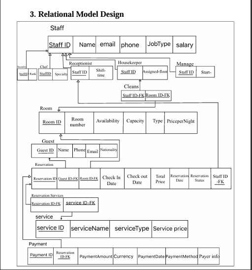

# Hotel Booking & Management System 🏨
A comprehensive relational database system designed to manage hotel operations including reservations, guest information, staff management, room allocation, services, and payment processing.

# Project Overview
This database management system addresses the inefficiencies of manual data handling in hotel operations by providing a structured, centralized solution for tracking reservations, managing staff, and analyzing business performance. The system ensures data consistency, eliminates duplication, and enables fast information retrieval through optimized SQL queries.

 # Key Features:

Reservation Management: Track guest bookings with automated date validation and availability checking
Staff Hierarchy System: Organized staff structure with role-based specializations (Receptionist, Housekeeper, Manager, Chef, Security)
Room Management: Monitor room availability, pricing, capacity, and maintenance status
Service Integration: Manage additional hotel services (Spa, Gym, Room Service, etc.) 
Payment Processing: Support multiple payment methods with currency tracking and payer information
Data Integrity: Comprehensive constraint enforcement including foreign keys, CHECK constraints, and business logic validation

# 🗂️ Database Schema
Entity-Relationship Model

The EER diagram demonstrates:
Specialization/Generalization: Staff entity with disjoint subclasses
Relationship Types: 1:1, 1:N, and M:N relationships properly mapped
Cardinality Constraints: Complete participation and relationship constraints

Relational Schema

The relational model includes 11 normalized tables:

-Staff (superclass) with subclasses: Receptionist, Housekeeper, Manager, Chef, Security
-Room, Guest, Reservation, Services, Payment
-Junction tables: ReservationServices, Cleans

# Technologies Used:

Database: Oracle SQL
Modeling: Enhanced Entity-Relationship (EER) Diagrams
Design Methodology: Conceptual → Logical → Physical database design
Normalization: Applied normalization principles to eliminate redundancy

This project was created for academic purposes as part of CS372 coursework.

